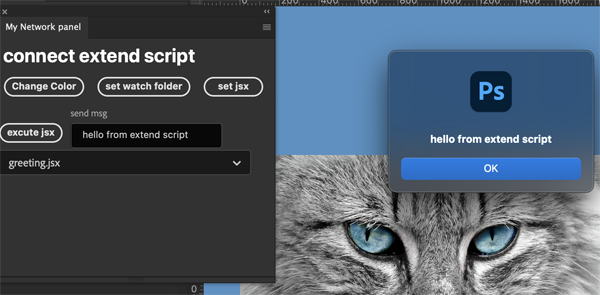

# onnect UXP and ExtendScript on Photoshop

Photoshop CEP doen's work on Mac , and now Adobe developed new system UXP
but UXP can't access local file for security reason , and some developers suffer for it. therefore they also hope to connect ExtendScript from UXP but there's no way to it.
so I found way to connect ExtendScript from UXP but this is complicated way to connect.
so this isn't good for plugin to distribute.
this is just temporary solution.

## How to connect.

Node.js fs module has watch method which watchs certain file or directory, so it can detect change or update on file.
so from UXP , write jsonData , and then Node.js detects it , after that , Node excutes ExtendScript , it can send argument as well.
so process is like this

1. uxp write json
2. Node.js detects it and reads json.
3. Node.js excutes ExtendScript and also send arguments
4. ExtendScript runs on Photoshop.

to run ExtendScript , I use [jsxk](https://github.com/loksland/jsxk)

## How to use this plugin specifically

install npm modules in watch directory.
and type "node watch"
then , Node.js is going to watch msg.json

and time to install UXP plugin , use AdobeUXPDeveloperTool
install this and call plugin on Photoshop.

click the set watch folder call the dialog (you have to call dialog a time but you don't need it anymore) and select "watch" folder in this plugin , and it'll find msg.json.
and than click the ser jsx button , it'll list jsx files from jsxes folder. and you can select jsx from list. you also can send message through send msg form.
finally , push the excute jsx , it'll write json.data , and then Node.jsx detectes it after that , Node.js runs ExtendScript and also send message.

